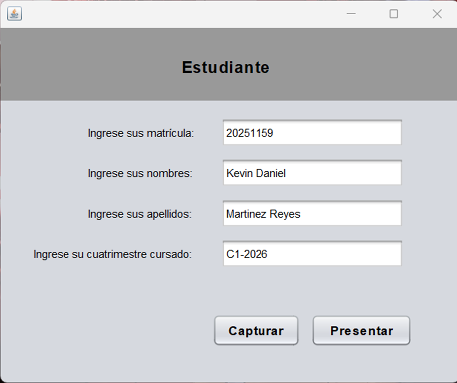
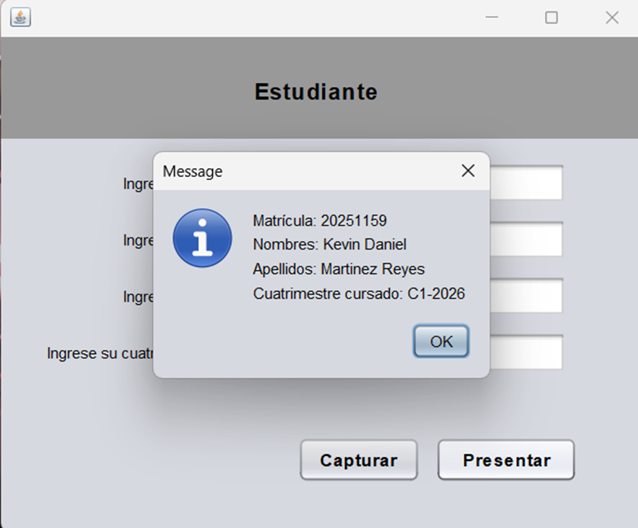

## Descripción
Este es un sistema que almacena los datos básicos de un estudiante a nivel técnico o superior.

## Instrucciones para su uso
1. Ejecutar el programa desde el archivo `InterfazParticipante.java`.
2. Llenar todos los campos con los datos requeridos.
3. Presionar el botón `Capturar` para guardar los datos.
4. Presionar el botón `Presentar` para ver los datos guardados.

## Imagenes del prógrama en uso

