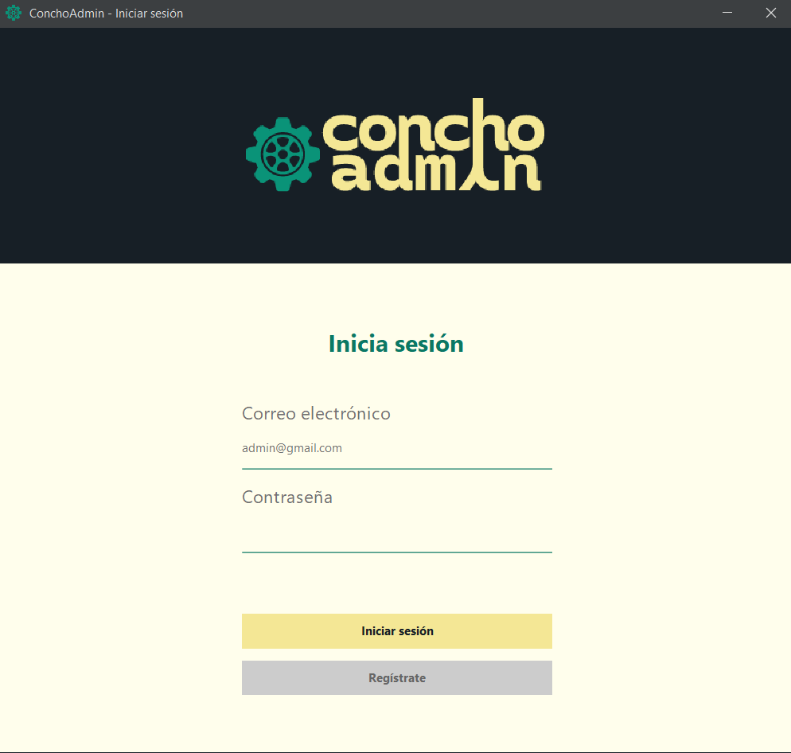
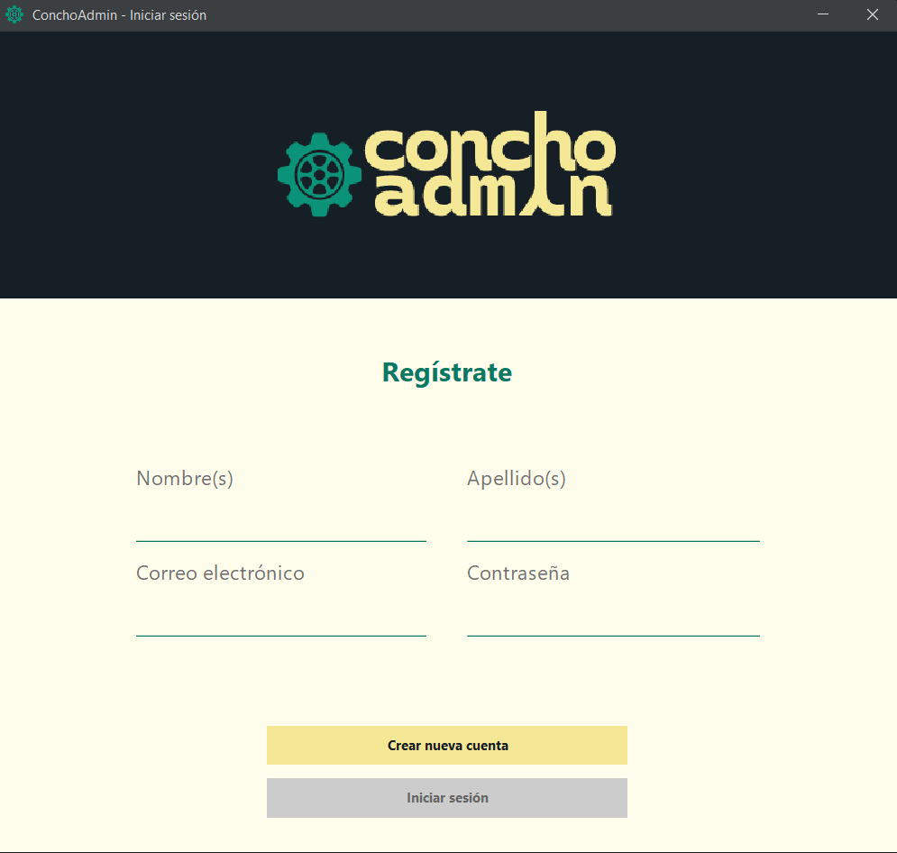
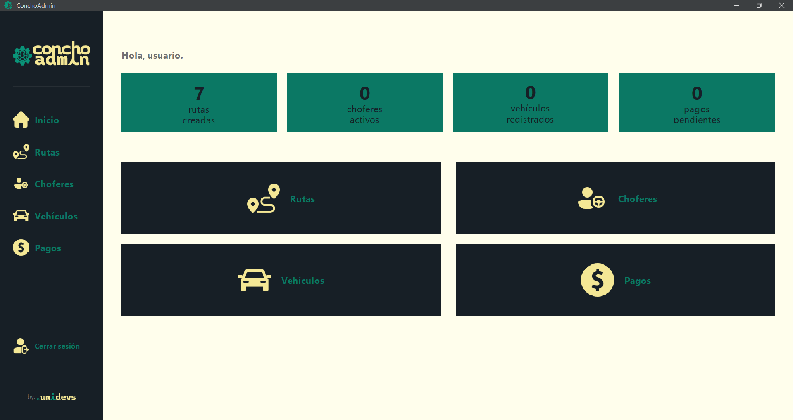

---

## Descripción
Concho admin es un sistema de gestión de rutas de transporte público que permite administrar choferes, vehículos y rutas. Con el fin de que los dueños de rutas tengan un mayor manejo de sus ingresos y choferes.

## Instrucciones para su uso
1. Agregar las librerías de la carpeta "Librerias" al class path del proyecto.
2. Ejecutar el programa desde el archivo `app.ConchoAdmin.java`.
3. Iniciar sesión si tienes cuenta existente o registrarte clickqueando "Registrarte".
4. Presionar el logo de `UNIDEVS` debajo del boton `Cerrar sesion` para saber acerca de la aplicación y su uso.

## Requisitos
* Java JDK 25
* Driver MySQL para JDBC
* Tener conexión a internet (los datos son almacenados en la nube).

## Imagenes del prógrama en uso

## UNIDEVS
Darvin Mendez - Lider del equipo.
Zoila García - Diseñadora.
Luis Moscoso - SQA.
Kevin Martinez - Administrador de la Base de Datos.