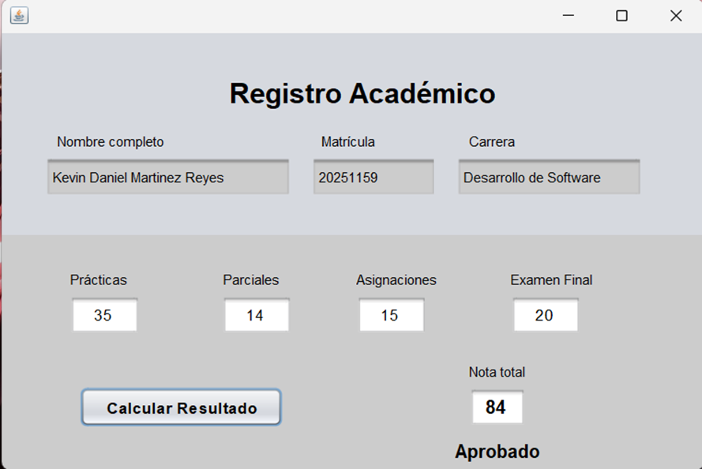
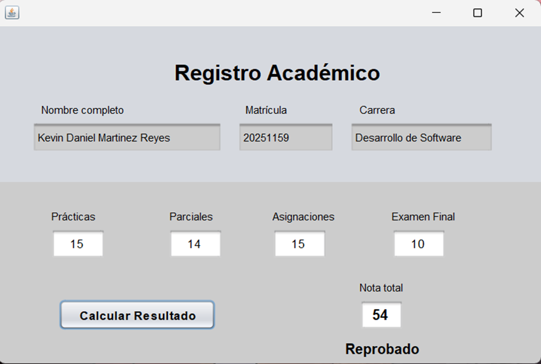
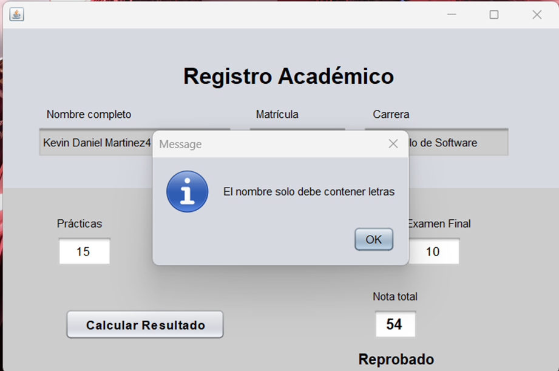

## Descripción
Este es un sistema básico que te permite calcular la puntuación total del estudiante evaluado.

## Instrucciones para su uso
1. Ejecutar el programa desde el archivo `Main.java`.
2. Llenar todos los campos con los datos requeridos.
3. Presionar el botón `Calcular Resulatado` para ver los resultados de la nota final.

**Nota**
Tomar en cuenta que al introducir el valor a cada uno de los campos debe presionar `Enter`.

## Imagenes del prógrama en uso

