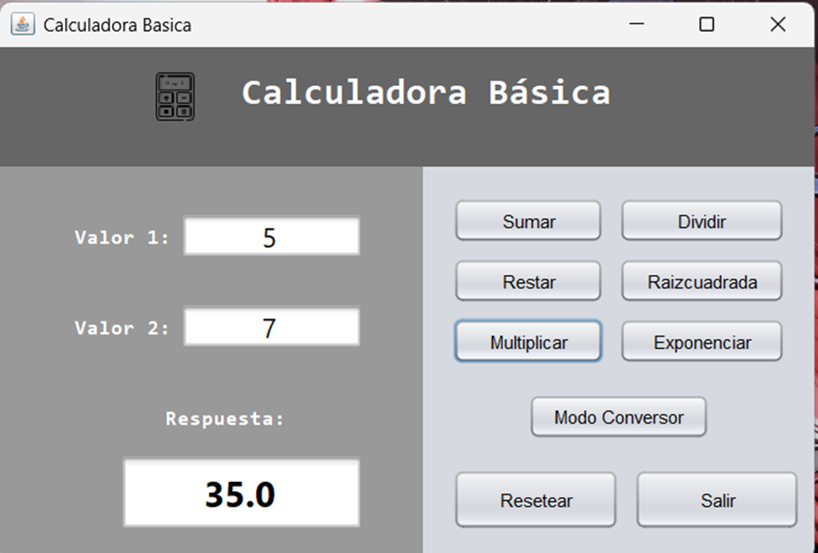
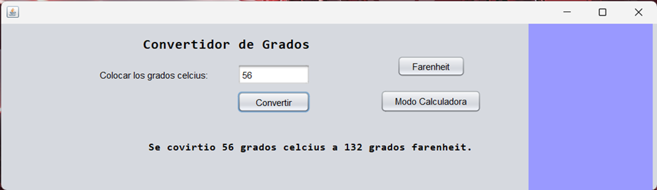
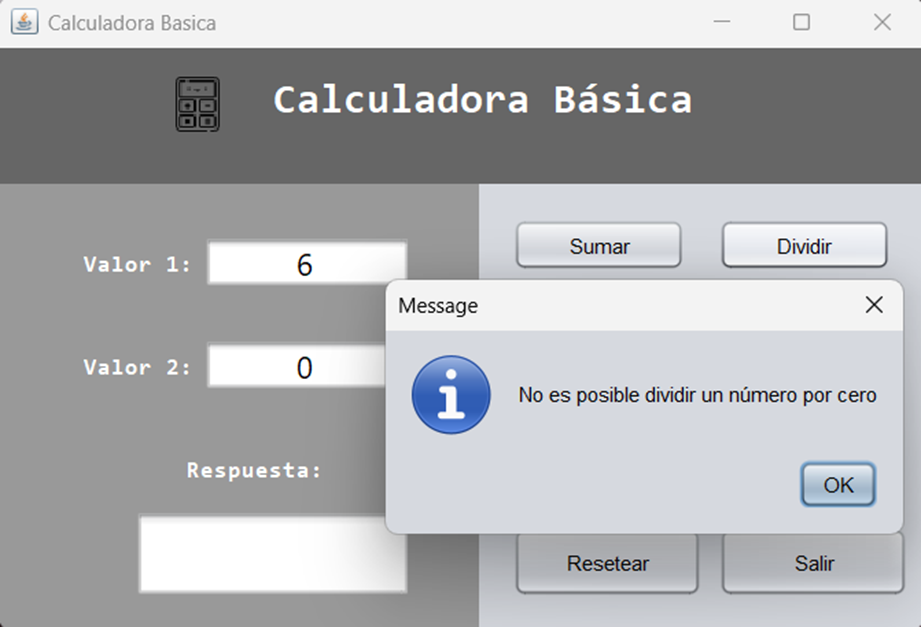

## Descripción
Este es un sistema intermedio de calculadora que te permite hacer operaciones básica(suma, resta, multiplicación y división), 
como también operaciones más avanzadas(raizcuadradra, exponenciación y conversiones de grados).

## Instrucciones para su uso
1. Ejecutar el programa desde el archivo `CalculadoraGUI.java` o `ConvertidorGradosGui.java`.
2. Llenar todos los campos con los datos requeridos.
3. Presionar el botón de la operación que quieras realizar para ver los resultados de la nota final.

**Nota**
Puede cambiar de un modo de calculadora a otro solo con presionar un boton.
Por ejemplo en la calculadora básica `Modo Conversor`.

## Imagenes del prógrama en uso

